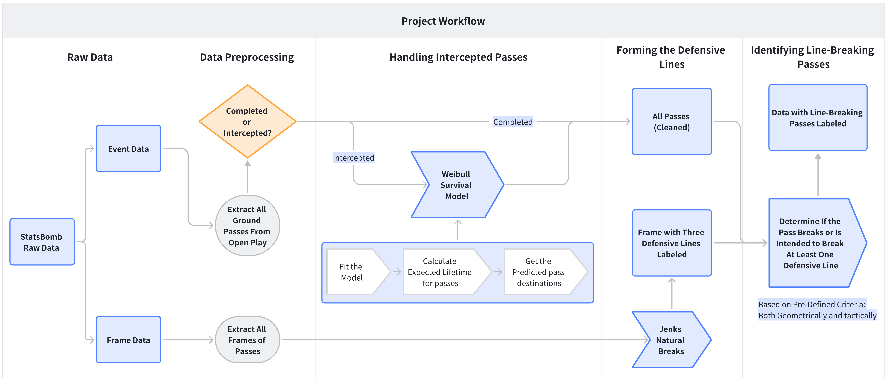
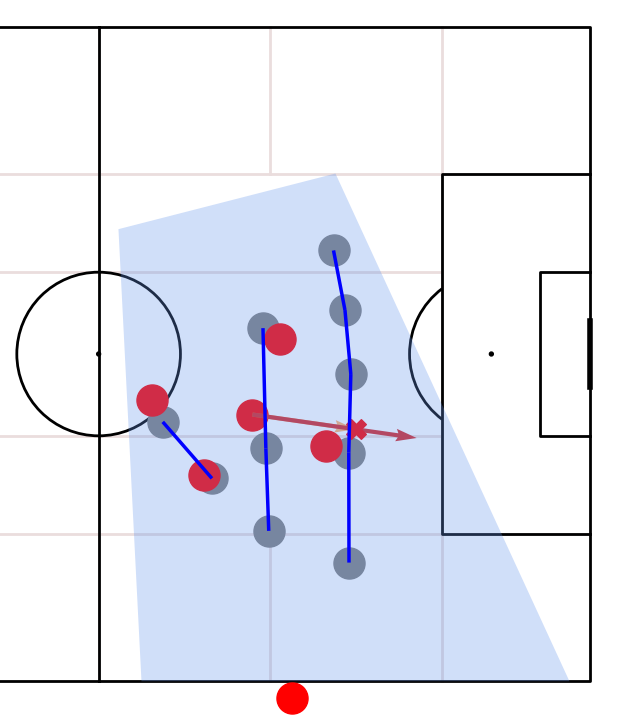
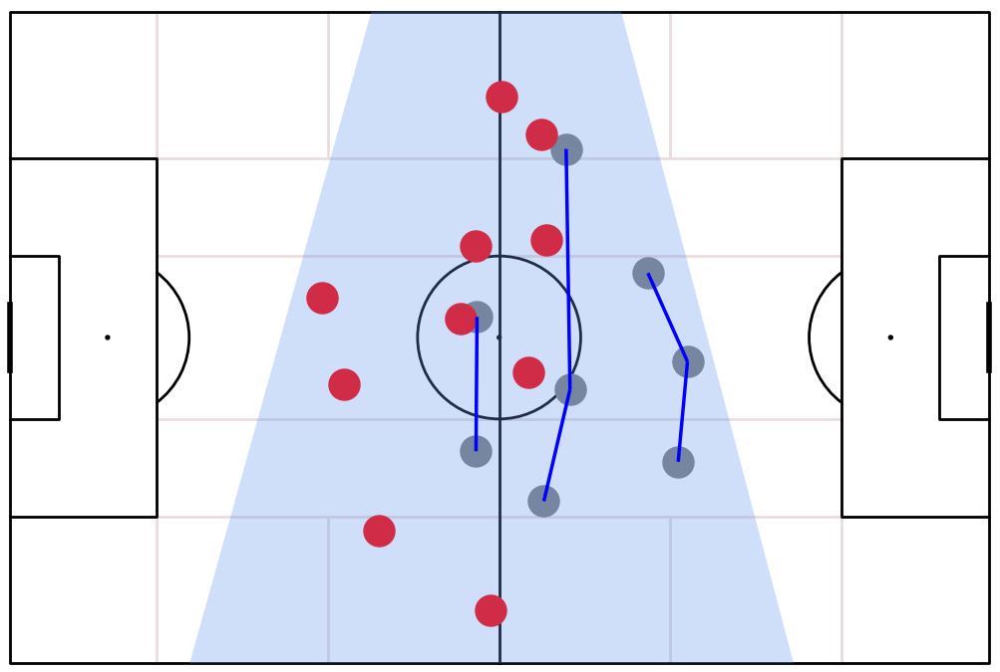
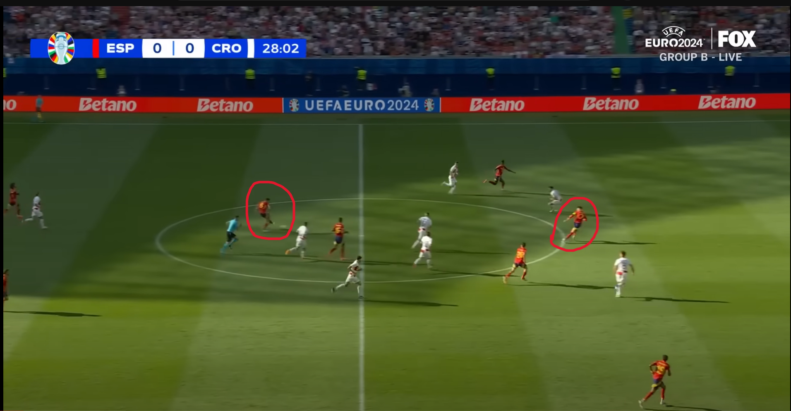
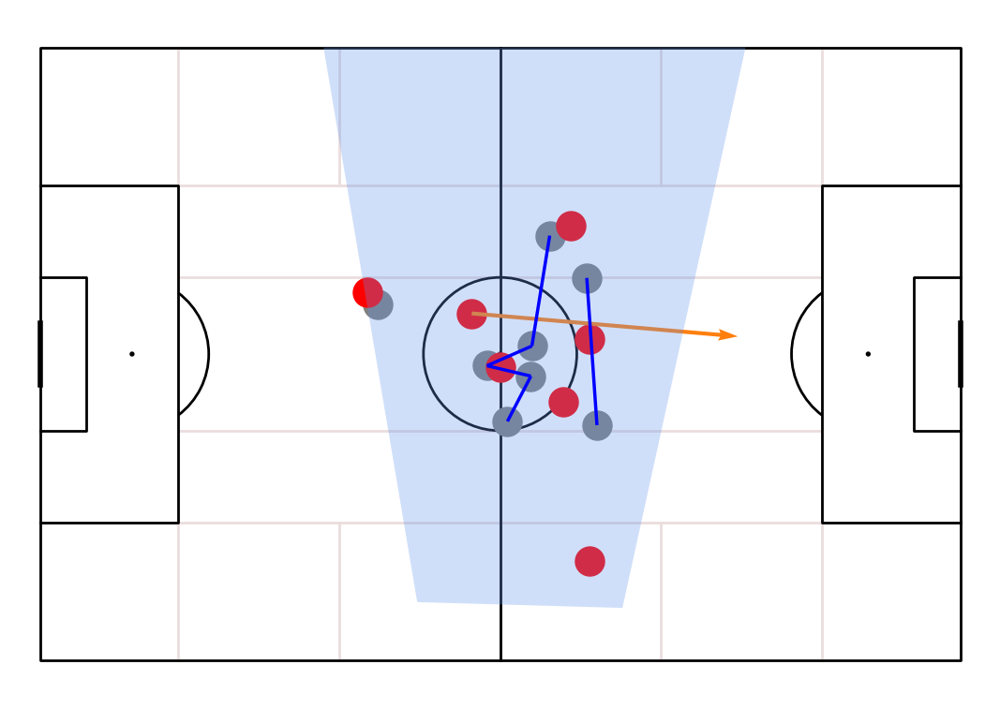
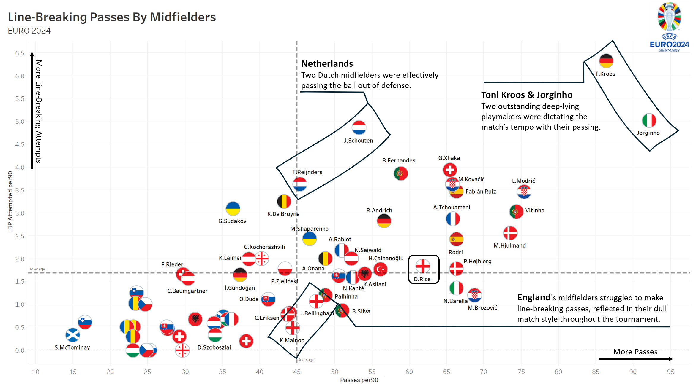
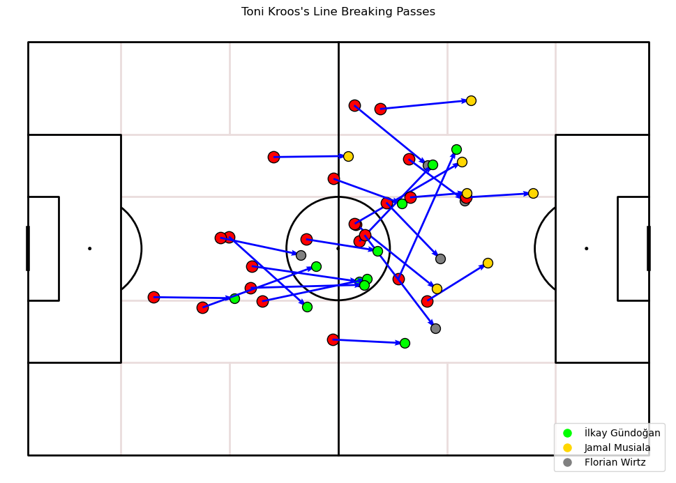

# Line-Breaking-Pass-in-EURO-2024
This project presents a method to model line-breaking passes in football using mathematical modeling and programming. It identifies line-breaking passes in EURO 2024 and analyzes teams' and players' passing prowess and style of play using this self-made metric.

For the full article with math derivation, feel free to visit [my Medium blog](https://medium.com/@WeiranLin/decoding-line-breaking-passes-in-euro-2024-806d8ac26882).

# Data Source
The source data is from [StatsBomb’s open data of EURO 2024](https://github.com/statsbomb/open-data). This includes all 51 matches’ event data and 360 data. StatsBomb 360 data contains all visible players’ positions for each frame captured, which enables us to see how two teams’ formations were organized when a pass was about to be delivered.

An easy way to access StatsBomb's data is through a Python package called `mplsoccer`, you can find complete guidance on [`mplsoccer`'s page](https://mplsoccer.readthedocs.io/en/latest/index.html).

# Methodology

## Project Workflow



## Handling Intercepted Passes

One major challenge here is dealing with those incomplete passes. Since they were intercepted, we can’t tell whether they were intended to be line-breaking or not simply from the event data. To tackle this, we can transfer the idea of one classic case in probability theory —— survival analysis. In this scenario, we see passing length as the random variable —— the lifetime of a pass, and a ball intercepted as death or failure. Then we can use the observed pass lengths to fit the Weibull Survival Model and calculate the expected lifetime (intended length) for each intercepted pass.

The expected lifetime is calculated by **conditional expectation**, given that a pass has already survived a certain distance.
```math
\begin{aligned}\mathbb{E}[T \mid T > s]&=\int_{\left( \frac{s}{\lambda} \right)^k}^\infty \lambda z^{\frac{1}{k}} e^{\left( \frac{s}{\lambda} \right)^k} e^{-z} \, dz =\lambda e^{\left( \frac{s}{\lambda} \right)^k} \Gamma\left(1 + \frac{1}{k}, \left( \frac{s}{\lambda} \right)^k \right)\end{aligned}
```
For detailed derivation and interpretation, please refer to my article [A Pass’s Expected Lifetime — An Application of Survival Analysis in Football](https://medium.com/@WeiranLin/a-passs-expected-lifetime-an-application-of-survival-analysis-in-football-1d4af36edca9).

By doing this, intercepted passes can now be treated the same as completed passes. For example, this pass won’t be identified as a line-breaking pass before since its actual ending point is not at least 2 meters beyond the line (criteria of line-breaking passes). However, after applying the method to get the predicted destination, we can state that this pass was intended to break the last defensive line. Therefore, this pass will be identified as an incomplete line-breaking pass instead of a non-line-breaking one.



## Forming the Defensive Lines

To determine if a pass broke or was intended to break a defensive line geometrically, we need to freeze all the players at that second (StatsBomb’s 360 data allows us to do so) and form them into lines. Basically, a defensive set-up is formed by three lines, and Jenks Natural Breaks Optimization —— a 1-D clustering method —— can effectively work in this case to cut the defensive players vertically into three lines.

Here's an example of a defensive setup:



> Note that not all players were in the frame because the frames are captured from broadcast. Generally, let Jenks Break Clustering to form three lines functions well.

## Identifying Line-Breaking Passes

Once the defensive lines are formed, we can utilize Python’s geometry libraries to write a function to determine if a pass at least intersects with one defensive line based on the set of rules we defined before. 

Here is one sample visualization of a line-breaking pass frame —— Fabian Ruiz’s assist to Alvaro Morata in Spain’s first match versus Croatia.



## Analysis

Having all passes labeled with line-breaking or not, we can do data analysis and visualization to evaluate teams' and players' line-breaking pass performance.

Here are two examples of my analytical works. The first graph (created in Tableau, the workbook file can be found in this repository, and team icons can be found in the folder) shows the midfielders' line-breaking pass performance with annotations. The second graph shows Toni Kroos's line-breaking passes delivered to German attacking midfielders.

Detailed analysis can be found in [my article](https://medium.com/@WeiranLin/decoding-line-breaking-passes-in-euro-2024-806d8ac26882).





-----------------------------------------------------------------------------
# Reference
[how-impactful-are-line-breaking-passes](https://www.statsperform.com/resource/how-impactful-are-line-breaking-passes/)
